# SoTBot - Your humble SoT based Discord bot
SoTBot is a Sea of Thieves themed Discord bot written in Go (Golang) and makes heavy use of the 
fantastic [discordgo](https://github.com/bwmarrin/discordgo) library.

## Requirements
To run SoTBot you require a Discord bot token. You can create one in the
[Discord developer portal](https://discord.com/developers/applications)

Also the bot uses SQLite3 for it's database. Therefore the libsqlite3 library is required to be present on the
machine running the bot.

To build the bot from the sources, you need to have Go installed

## Binary release
Pre-compiled binaries for Linux/x86_64 and Darwin/amd64 are attached with to every release on the 
Github release page or can be found in the [releases](/releases) folder. Other platforms might follow soon.

The release files are digitally signed with the excellent [Minisign](https://jedisct1.github.io/minisign/) by
Frank Denis. To verify the signature just use the following command
```shell
$ minisign -Vm <release_file>.tar.gz -P RWRleNjCzit8IXBZpfsdFsJlG4U8R68OoOE+bmjWkwa1mxtsrjxeFpbW

Signature and comment signature verified
Trusted comment: SoTBot v1.3.2 - OS: darin // Arch: amd64
```
The projects Minisign public key is also available in this repository as [minisign.pub](minisign.pub)

Please make sure to verify the signature before using any binary release.

## Building from source
There is a `Makefile` included in the project. Just run `make` and your Bot binary will be built in
as `./bin/sotbot`

## Dicord bot token
You need to create a Discord bot in the Discord developer portal and then invite the bot to your discord 
server. For the bot to work properly, it needs to have a specific set of permissions. This is the minimal set
of permissions the bot requires:
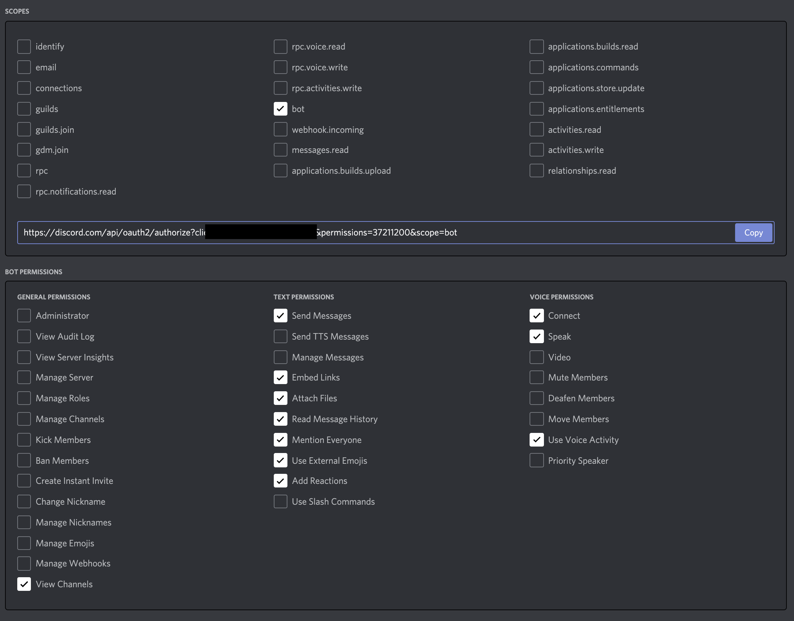

To automatically track when a user is playing SoT, the bot also needs to see presence changes. This is a special
permission that need to specifically be enabled for your bot. If you don't enable this feature, the auto tracking
will not be working.
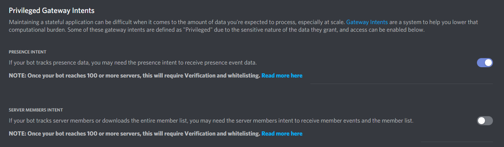

## Configuration
For the bot to run, you need a valid configuration file. The filename of the config needs to be `sotbot.json`. An 
example config can be found in the `./config` directory of this repository. By default the bot checks 2 default
directories for this file, in this order: `$HOME/.sotbot/sotbot.json` and `./config/sotbot.json`.

The config currently supports the following format:
```json
{
    "authtoken": "Put your authentication token here",
    "audiofiles": {
        "airhorn": "airhorn.dca",
        "fart": "fart.dca",
        "pirate": "pirate.dca"
    },
    "dbfile": "/home/sotbot/.sotbot/sotbot.db",
    "announcechan": "123456789012345678",
    "sot_play_announce": true,
    "sot_play_dm_user": false, 
    "tmdb_api_key": "Put your TMDb api key here", 
    "owm_api_key": "Put your OpenWeatherMap api key here"
}
```

#### Config parameters
* `authtoken`: this is your discord bot token, that you need to aquire from the development portal
* `audiofiles`: this is an associated array of audio files that can be played using the `!play` command.
  the files for this need to be placed in the `./media/audio/` directory of the bot. please keep in mind
  that the bot will load all defined audio files into ram, so the more files you add, the more ram the
  bot will consume.
* `dbfile`: The path where the SQLite3 database file of the bot will be stored. Keep in mind, that the DB
  will store user information like authentication cookies unencrypted.
* `announcechan`: The channel ID of the official announcement channel for the bot. Any feature that uses
  the "announce" feature of the bot, will be sent to this channel
* `sot_play_announce`: If set to `true`, user tracking is enabled and the user is registered, the bot will 
  announce when a user played SoT to the official announcement channel and will also tell the difference in 
  balance they made during the last playing session
* `sot_play_dm_user`: If set to `true`, user tracking is enabled and the user is registered, the bot will
  DM the user after they played SoT and provide them with their new balance
* `tmdb_api_key`: If you want to use the TMDb commands, you need to have a valid API token. For more details
  check the [TMDb API documentation](https://developers.themoviedb.org/3/getting-started/authentication)
* `owm_api_key`: For the weather commands to work, you need to have a valid OWM API token. For more details
  check the [OWM API documentation](https://openweathermap.org/appid)

## Commands
SoTBot is heavily influenced by the Eggdrop bots of the olden IRC days. A couple of its commands are SoT-themed, but
there are couple of fun non SoT-related commands as well.

### User management
SoTBot has very minimalistic user management built in, so it can keep track of some user specific settings.
User information is based on your discord userid and will be stored in a SQLite database on the server running
the bot.

#### User registration
For the bot to use some specific commands (especially the SoT-themed commands), users need to be registered. 
Only users with discord admin permission can "register" users with the bot.

To register a user, use the `!register` or `!reg` command. \
Example: `!register @johndoe`

#### User unregistration
Admins can also delete users from the database again, using the `!unregister` or `!unreg` command. \
Example: `!unregister @johndoe`

### Sea of Thieves related commands
Only registered users will be able to use the SoT specific bot features, as this requires API access, which
needs to be assigned to users.

#### Getting access to the API
Unfortunately the SoT API does not offer any kind of OAuth2 for authentication, hence we have to use
a kind of hackish way to get your access cookie from the Microsoft Live login. You can use Simon's
[SoT-RAT-Extractor](https://github.com/echox/sot-rat-extractor) (please read the notes in the project before using
it) to get a current cookie and store it in the database of the bot. Unfortunately the cookie is only valid for 
14 days, so you'll have to renew it every now and then.

#### Important security note
The RAT cookie gives full access to your SoT account page and the bot does not store the cookie in any 
encrypted way. Therefore, before storing your cookie in the bot's DB, please make sure that you know what
you are doing. Maybe at some time, RARE decides to offer an API which offers OAuth2, so we can allow the bot
having access to the API data without having to store/renew the cookie.

#### RAT Cookie registration
Once you have you user registered and obtained a valid cookie using the `SoT-RAT-Extractor`, you have to store
it in the bot's database. To do so, you have to DM the bot and use the `!setrat` or `!rat` command followed by the 
extracted cookie. Please keep in mind that this only works in the DMs and will not work in a public channel
for security reasons.

Example:
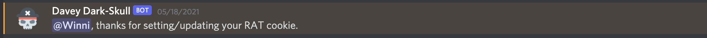

**Note:** As mentioned already, the cookie situation is not perfect and the cookie will expire after 14 days. This
means that after 14 days, the bot will not be able to access the API anymore until you update your cookie. When
the bot runs into 3 continous failed API request, the bot will notify you in a DM about the fact that your cookie
has likely expired and you need to renew it. Once done, it will not notify you anymore unless you used the 
`!setrat` command again to update your cookie. This will reset the "notified" flag for the user. When the "notified"
flag is set, the bot will also not try to access the API anymore to avoid too many failed requests until the 
"notifed" flag was removed.

#### User balance
With the `!balance` or `!bal` command, the Bot will query you current balance of Gold, Ancient Coins and Doubloons 
from the API and will output it to you in the channel you requested it.

Example:
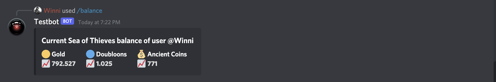

#### Automatic user balance tracking
The bot is able to track the users presence state. If a registered user has their "Currently playing" feature
associated with Discord and starts playing "Sea of Thieves", the bot will automagically fetch the users current
balance and once the user stops playing, repeat the process. The before and after values are then compared and 
announced in the official announcement channel of the server (if that feature is enabled in the config and the
bot has text permissions in that channel). The bot can also send the user an automatic DM when they stopped playing
with the current balance - this is also configurable.

Example:
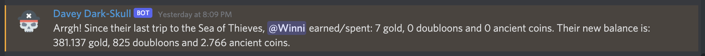

#### Latest achievement
Using the `!achievement` or `!achieve` command, the bot will fetch your achievements list from the API and 
present you with your latest completed achievement.

Example:
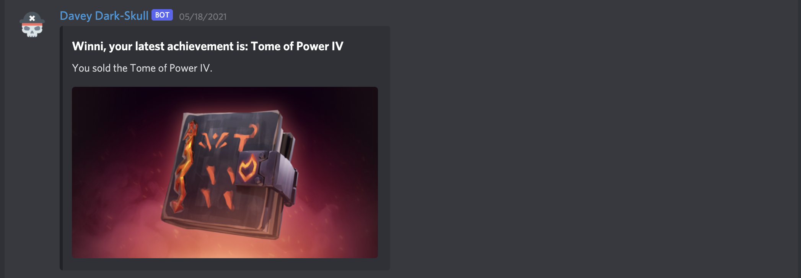

#### Season progress
When you enter the `!season` command, the bot will fetch your season progress and present you with a little 
summary of it.

Example:
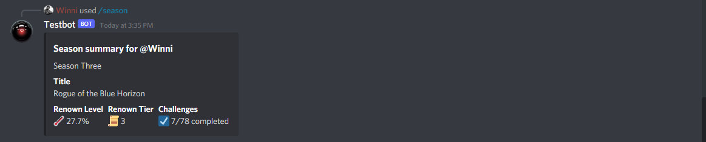

#### Faction/Company reputation
The `!reputation` or `!rep` command, followed by one of the supported faction names, will let the bot fetch 
your current reputation and XP level with the requested faction/company.

Supported factions:
  * athena
  * bilge
  * hoarder
  * hunter
  * merchant
  * order 
  * reaper
  * seadog

Example:
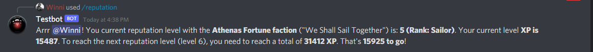

#### Faction/company ledger stats
With the `!ledger` or `!led` command, followed by one of the supported faction names, the bot fetch
your current position in the factions ledger, together with the rank and the amount of poins missing, to level
up to the next rank.

Supported factions:
* athena
* hoarder
* merchant
* order
* reaper

Example:
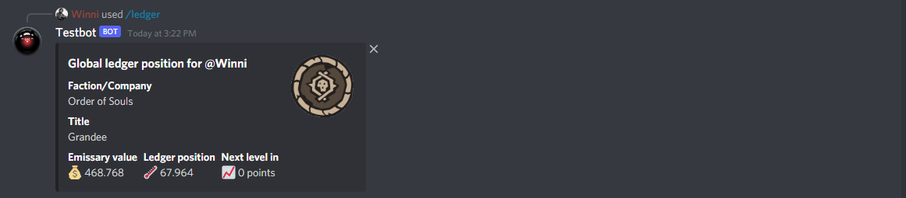

#### The pirate code
When you issue a `!code` in the channel, the bot will present you with a random article from the SoT's pirate
code.

Example:
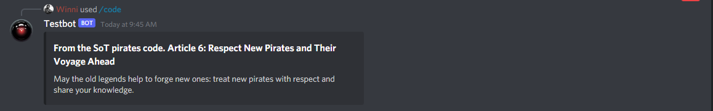

#### General statistics
The `!stats` or `!stat` command will provide you with some general stats about your SoT travels

Example:
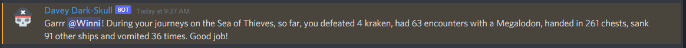

#### Daily deeds
With the `!deed` or `!dd` command, you can ask the bot to fetch the currently active "daily deed" in SoT

Example:
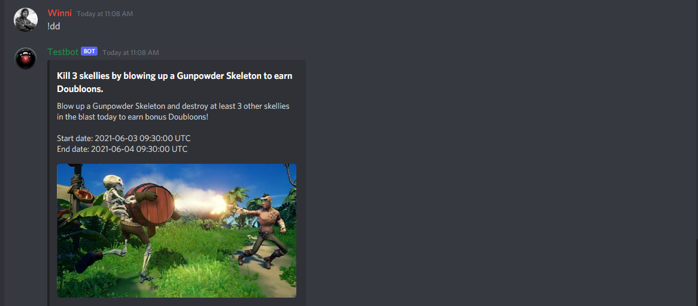

### Play sound feature
With the `!play` feature, when you are active in a voice channel, you can have the bot join and play a predefined
sound. The bot is "shipped" with predefined sounds in the config (see `audiofiles` in `sotbot.json`). So using 
the command `!play airhorn` will have your bot look up, which voice chat you are currently in, try to join the
voice chat and play that sound. Then immediately leave the voice chat again.

### Time feature
Using the `!time` command, the bot will present you with the current date and time.

Example:
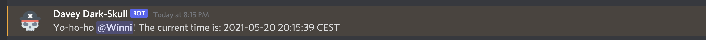

### Useless facts
The `!fact` command will have the bot fetch a random useless fact from the uselessfacts API and respond with it
back to you.

Example:
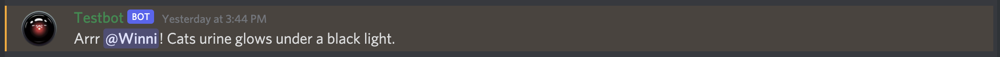

### Urban dictionary
To query the Urban Dictionary, you can use the `!urban` or `!ud` command. If used without any arguments, a random
term will be looked up. If followed by a term, the actual term will be looked up and the first result presented to
the requester.

Example:
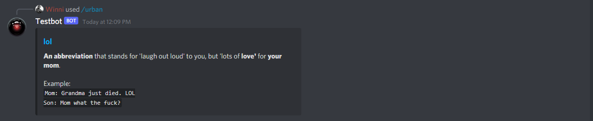

### The Movie Database
With the `!movie` command, you can have the bot look up a random movie from [The Movie Database](https://themoviedb.org) 
(TMDb). If the command is followed by arguments, the arguments will be used as search string.

The same applies to `!tv`, but instead of movies it will look up TV series.

For this feature to work, you need a valid API key for the TMDb API. If no API key is found in the config file, an
error will be returned from the bot.

Example:
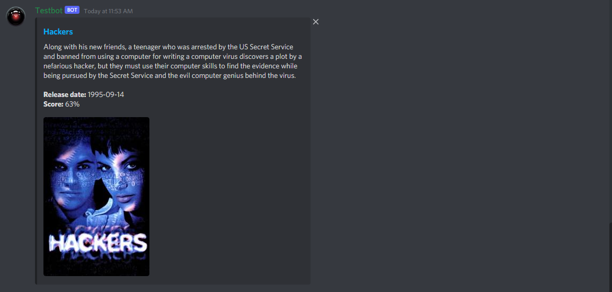

### Open Weather Map
By issuing the `!weather` command, you can have the bot look up the current weather in a provided location.

For this feature to work, you need a valid API key for the OWM API. If no API key is found in the config file, an
error will be returned from the bot.

Example:
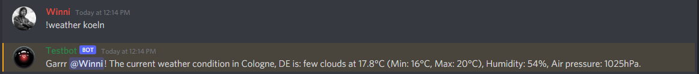

### Version
When requested the `!version` command, the bot will respond with it's current version and some build information.

Example:


## Helpful stuff
### Converting a MP3 file to a bot-compatible DCA file
You first need to install [ffmpeg](https://ffmpeg.org/) and [dca](https://github.com/bwmarrin/dca). Then run:
```shell
$ ffmpeg -i file.mp3 -f s16le pipe:1 | dca >./media/audio/file.dca
```

## Attribution
The sounds that are provided in this repository are by the following people:
* Airhorn by kneedrawp: https://www.youtube.com/watch?v=1SVe1D7er-U
* Fart sound by Paula: https://soundbible.com/1605-Blowing-A-Raspberry.html
* Angry pirate sound by Mike Koenig: https://soundbible.com/858-Angry-Pirate.html